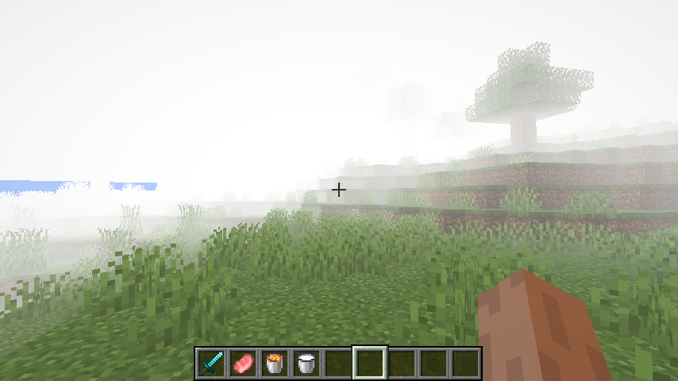

# Fog 

[Power Type](../power_types.md)

This power lets you alter the fog the player sees around them.

!!! tip "Version Added: 2.0.0"

    
### Fields

Field  | Type | Default | Description
-------|------|---------|-------------
red | [Float](https://origins.readthedocs.io/en/latest/types/data_types/float) | `1.0` | Default red value for color, Range of: [0.0 - 1.0].
green | [Float](https://origins.readthedocs.io/en/latest/types/data_types/float) | `1.0` | Default green value for color, Range of: [0.0 - 1.0].
blue | [Float](https://origins.readthedocs.io/en/latest/types/data_types/float) | `1.0` | Default blue value for color, Range of: [0.0 - 1.0].
start | [Integer](https://origins.readthedocs.io/en/latest/types/data_types/integer/) | `-5` | This is the start distance for the fog.
end | [Integer](https://origins.readthedocs.io/en/latest/types/data_types/integer/) | `30` | This is the end distance for the fog.
### Example

```json
{
  "type": "moborigins:fog",
  "red": 1,
  "green": 1,
  "blue": 1,
  "start": -1,
  "end": 30,
  "condition": {
    "type": "apoli:sneaking",
    "inverted": true
  }
}
```
This makes it so the player has a thick white fog, which can be disabled by sneaking.
This looks like: 
